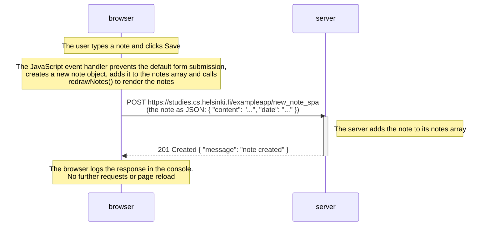

```mermaid
sequenceDiagram
    participant browser
    participant server

    Note over browser: The user types a note and clicks Save
    Note over browser: The JavaScript event handler prevents the default form submission,<br/>creates a new note object, adds it to the notes array and calls<br/>redrawNotes() to render the notes

    browser->>server: POST https://studies.cs.helsinki.fi/exampleapp/new_note_spa <br/>(the note as JSON: { "content": "...", "date": "..." })
    activate server
    Note right of server: The server adds the note to its notes array
    server-->>browser: 201 Created { "message": "note created" }
    deactivate server

    Note over browser: The browser logs the response in the console.<br/>No further requests or page reload
```
